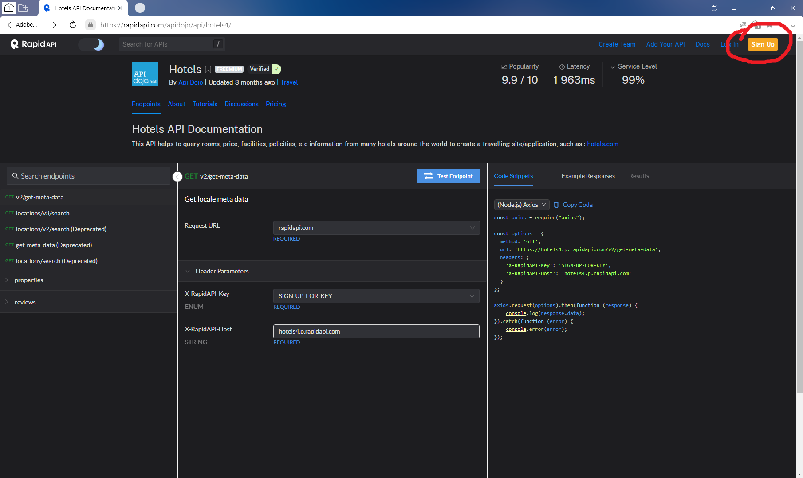
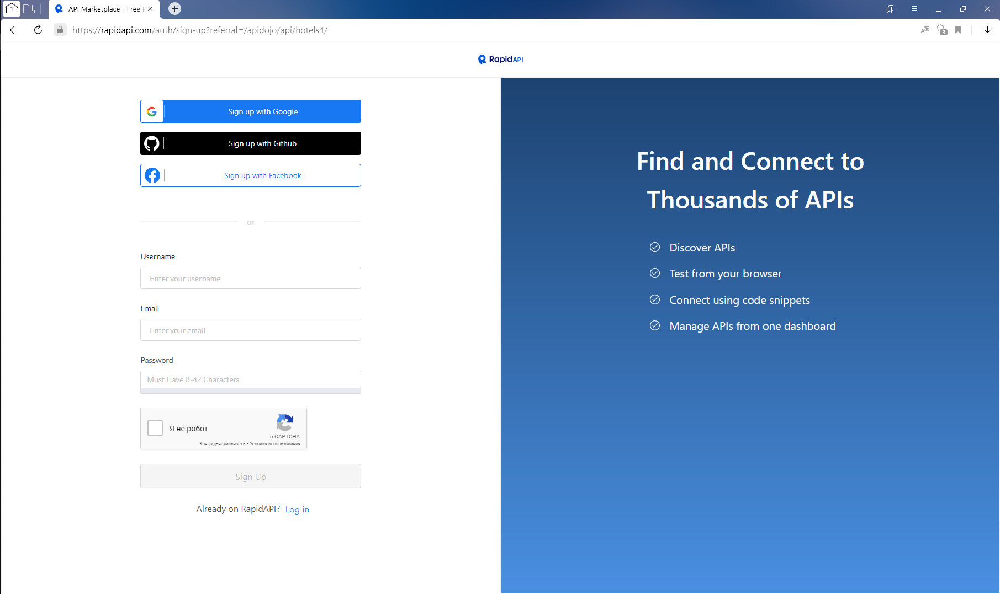
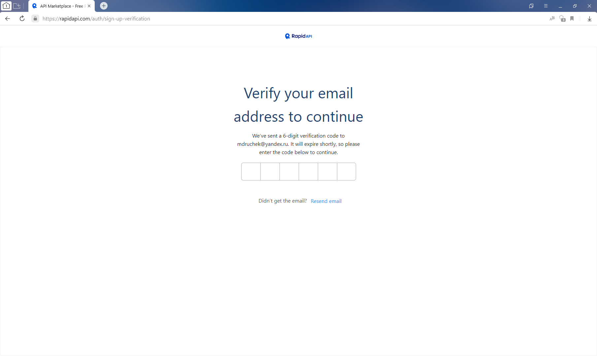
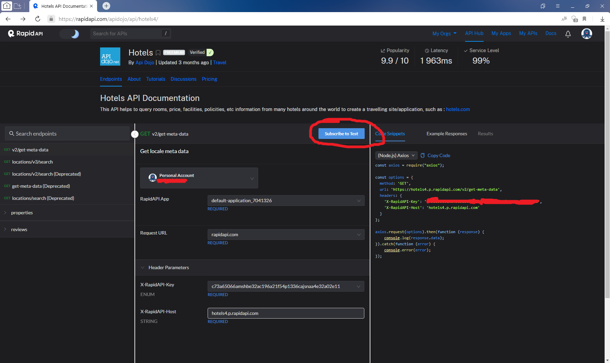
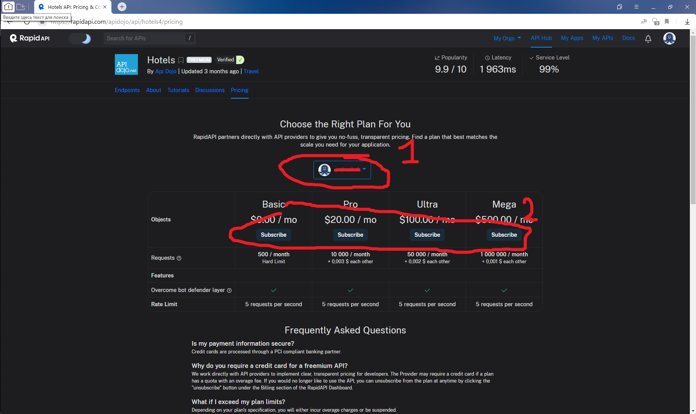
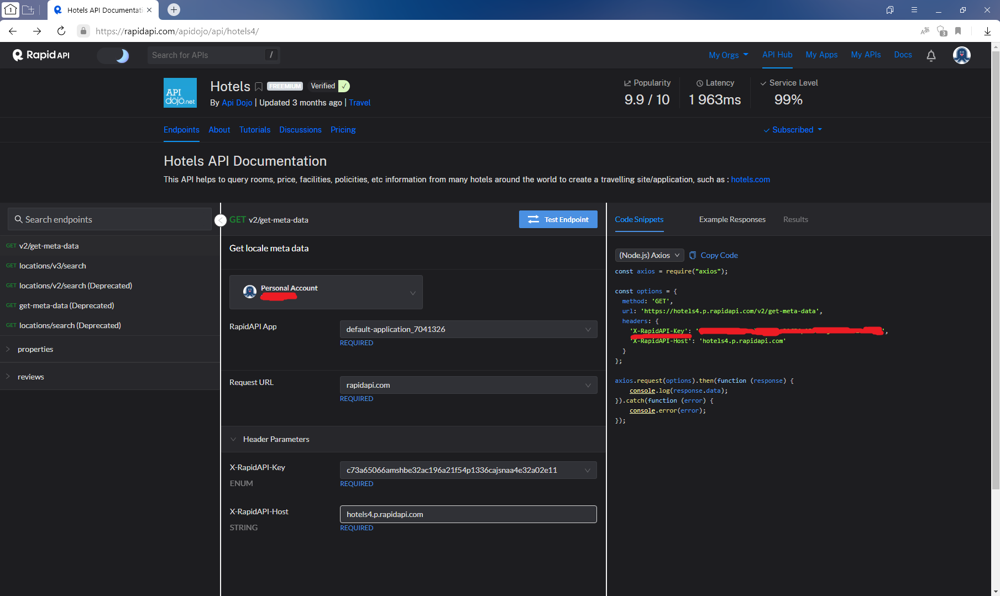

О проекте.

Проект предназначен для создания чат-бота Telegramm. Чат-бот предназначен для подбора отелей по названию
города пребывания, датам заезда и выезда, диапазонам цен и расстояния от центра города.
Чат бот взаимодействует с API сайта https://rapidapi.com, в свою очередь https://rapidapi.com берёт информацию
с сайта ...  

Запуск проекта.  

Для запуска прокта необходимо выполнить следующее:  
1. Скачать проект.  
2. Скачать и установить puthon, перейдя по ссылке https://www.python.org/downloads/  
3. Установить библиотеки python: pyTelegramBotAPI и requests.  
   Лучше устанавливать версии библиотек указанные в файле requirements.txt проекта.
   С другими версиями проект может не работать.
   Подробности, например, тут: https://teletype.in/@pythontalk/requirements.  
4. Перейти в консоли в папку с проектом и выполнить команду: python main.py  
5. По запросу консоли ввести token чат-бота Telegramm и rapidapi-key сайта https://rapidapi.com.  
   Как их получить, описано ниже.  
    5.1 Создание чат бота и получение его токена можно посмотреть, например, тут:
         https://web7.pro/kak-poluchit-token-bota-telegram-api/  
    5.2 Регистрация на сайте https://rapidapi.com и получение 'rapidapi-key':  
        - Открыть браузер и перейти на сайт https://rapidapi.com:  
        - Нажать 'Sign Up' в правом верхнем углу:  
              
        - Ввести имя пользователя, электронную почту и пароль:  
              
        - На указанную электронную почту придёт письмо с кодом, для ввода на сайте для завершения регистрации:  
              
        Необходимо ввести код.  
        - Ввести организацию, если необходимо, и/или нажать 'Done', сняв или оставив галочку регистрации организации:  
              
        - Перейти по ссылке https://rapidapi.com/apidojo/api/hotels4/.  
        - В открывшемся окне нажать кнопку 'Subscribe to Test'  
              
        - Выбрать свой профиль и, подходящий по количеству запросов (Requests) и стоимости, тариф:  
              
        - На странице https://rapidapi.com/apidojo/api/hotels4/ в правой области скопировать значение 'X-RapidAPI-Key'
          и ввести в консоль:  
               
5. Открыть чат с Вашим ботом в Telegramm и проверить его работу  

Взаимодействие с чат-ботом Telegramm.  

После удачного запуска скрипта из консоли, открыть чат-бот в Telegramm. Команды можно выбирать нажатием на кнопку 'Menu',
либо вводом символа '/' в ... При выборе команды '/help' будет выведена подсказка по командам бота.  

Список команд:  
/help - помощь по командам бота  
/lowprice - вывод самых дешёвых отелей в городе  
/highprice - вывод самых дорогих отелей в городе  
/bestdeal - вывод отелей, наиболее подходящих по цене и расположению от центра  
/history - вывод истории поиска отелей  

После выбора команды следует отвечать на вопросы бота нажатием на встороенную клавиатуру, либо вводом в строку набора
сообщений чат-бота.  